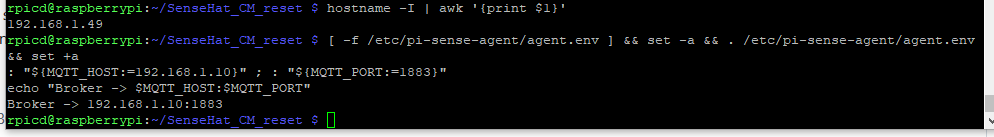
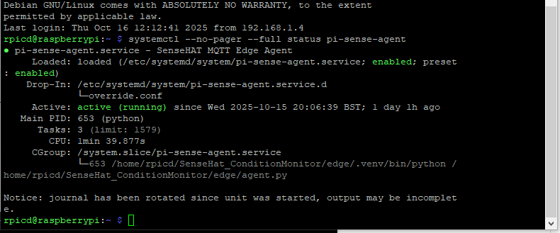
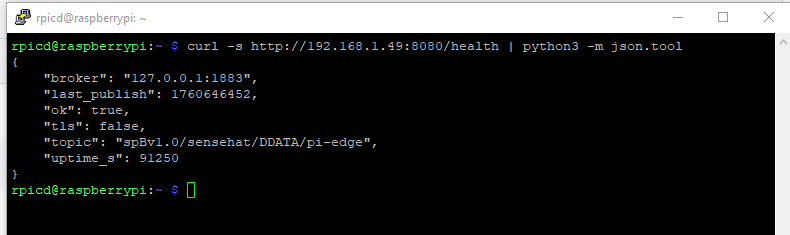
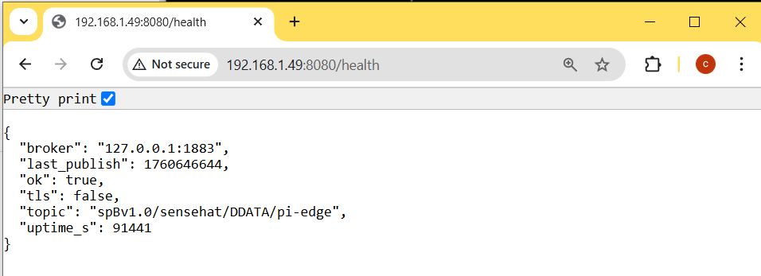
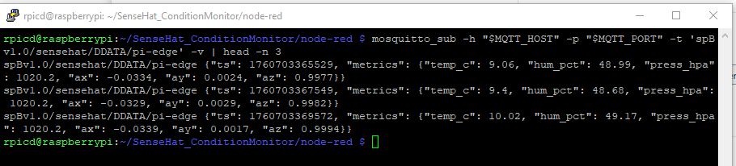
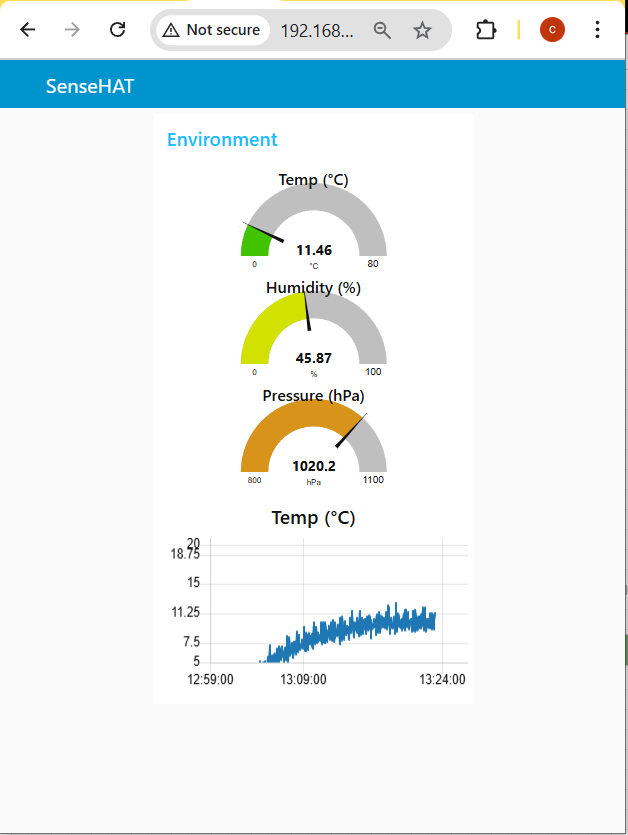
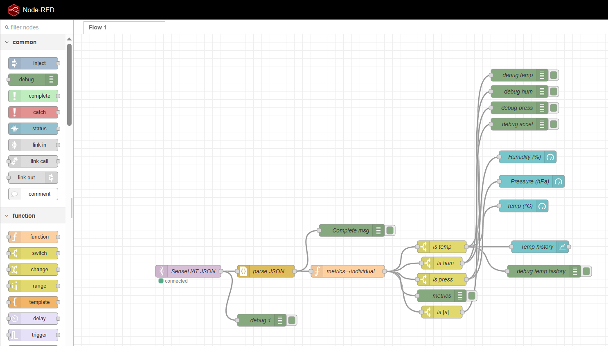
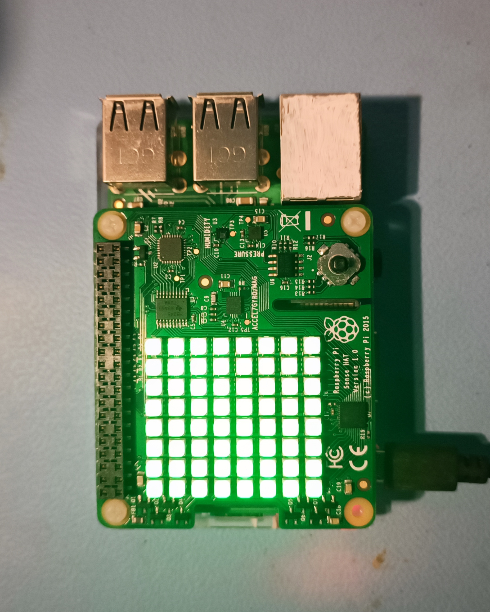
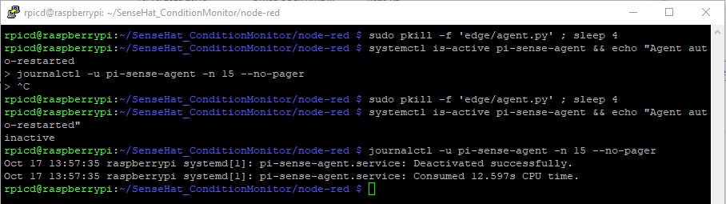
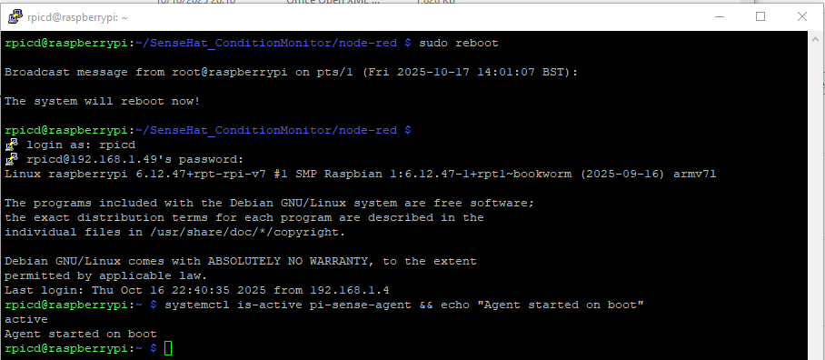

# System Test — SenseHAT Condition Monitor (Screenshots & Evidence)

This document captures a full end-to-end smoke test of the Raspberry Pi + Sense HAT edge node.  
Each step shows the command(s) to run and a **screenshot link** pointing to files under `docs/images/`.

> **Tips**
> - Keep screenshots 16:9 (~1920×1080).
> - Use terminal font 16–18pt.
> - Redact any secrets.
> - Replace `<pi-ip>` with your device IP.
> - Save images using the suggested filenames so the links render on GitHub.

[← Back to README](README.md)

---

## 0) Prep — IP & Broker

### Commands
```bash
hostname -I | awk '{print $1}'
[ -f /etc/pi-sense-agent/agent.env ] && set -a && . /etc/pi-sense-agent/agent.env && set +a
: "${MQTT_HOST:=192.168.1.10}" ; : "${MQTT_PORT:=1883}"
echo "Broker -> $MQTT_HOST:$MQTT_PORT"
```

### Screenshot (save as)
**docs/images/00_prep_ip_broker.PNG**  


---

## 1) Service Up — systemd Status

### Command
```bash
systemctl --no-pager --full status pi-sense-agent
```

### Screenshot (save as)
**docs/images/01_service_status.png**  


---

## 2) Health Endpoint — curl & Browser

### Command (curl)
```bash
curl -s http://192.168.1.49:8080/health | python3 -m json.tool
```

### Screenshots (save as)
**docs/images/02a_health_curl.png**  


**docs/images/02b_health_browser.png**  


---

## 3) MQTT Telemetry — First Messages

### (Install client if needed)
```bash
sudo apt-get update && sudo apt-get install -y mosquitto-clients
```

### Command
```bash
mosquitto_sub -h "$MQTT_HOST" -p "$MQTT_PORT" -t 'spBv1.0/sensehat/DDATA/pi-edge' -v | head -n 3
```

### Screenshot (save as)
**docs/images/03_mqtt_sub.png**  


---

## 4) Node-RED Dashboard (& Optional Import)

### Open
```
http://<pi-ip>:1880/ui
```

### Screenshots (save as)
**docs/images/04a_nodered_ui.png**  


*(optional)* **docs/images/04b_nodered_import.png**  
*(optional)* 

---

## 5) Sensor Sanity — Before / After

### Action
Briefly breathe near the HAT (humidity spike), touch/cover (temp nudge), or tilt (accel change).

### Screenshots (save as)
**docs/images/05a_sanity_before.png**  


**docs/images/05b_sanity_after.png**  


*(optional hardware photo)* **docs/images/05c_hardware_action.jpg**  
*(optional)* 

---

## 6) Resilience — Crash & Reboot

### Commands
```bash
# Auto-restart on crash?
sudo pkill -f 'edge/agent.py' ; sleep 4
systemctl is-active pi-sense-agent && echo "Agent auto-restarted ✅"
journalctl -u pi-sense-agent -n 15 --no-pager

# Survives reboot?
sudo reboot
# after login:
systemctl is-active pi-sense-agent && echo "Agent started on boot ✅"
```

### Screenshots (save as)
**docs/images/06a_restart_autorecover.png**  


**docs/images/06b_reboot_active.png**  


---

## 7) Common Fixes — Quick Triage

### Commands (pick what applies)
```bash
journalctl -u pi-sense-agent -n 50 --no-pager
sudo nano /etc/pi-sense-agent/agent.env
systemctl status nodered --no-pager
```

### Screenshots (save as)
**docs/images/07a_journal_logs.png**  


**docs/images/07b_agent_env.png**  


**docs/images/07c_nodered_status.png**  


---

## 8) QoS1 + Retained — Show the Difference

### Commands
```bash
# retained arrives immediately
mosquitto_sub -h "$MQTT_HOST" -p "$MQTT_PORT" -t 'spBv1.0/sensehat/DDATA/pi-edge' -v | head -n 1

# ignore retained (live only)
mosquitto_sub -h "$MQTT_HOST" -p "$MQTT_PORT" -t 'spBv1.0/sensehat/DDATA/pi-edge' -R -v | head -n 2
```

### Screenshots (save as)
**docs/images/08a_retained_on_connect.png**  


**docs/images/08b_ignore_retained_R.png**  


---

## Notes

- Keep Node-RED credential files out of git (see `.gitignore`).  
- For production, enable MQTT TLS/credentials and restrict Node-RED editor access.  
- Place all screenshots in `docs/images/` using the filenames shown above.
