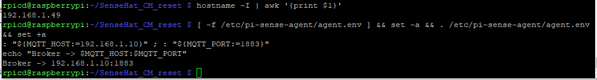

# System Test — SenseHAT Condition Monitor (Screenshots & Evidence)

This document captures a full end-to-end test of my Raspberry Pi + Sense HAT edge node.  
Each step shows the command(s) to run and a **screenshot link** pointing to files under `docs/images/`.


[← Back to README](README.md)

---

## 0) Prep — IP & Broker

### Commands
```bash
hostname -I | awk '{print $1}'
[ -f /etc/pi-sense-agent/agent.env ] && set -a && . /etc/pi-sense-agent/agent.env && set +a
: "${MQTT_HOST:=192.168.1.10}" ; : "${MQTT_PORT:=1883}"
echo "Broker -> $MQTT_HOST:$MQTT_PORT"
```

### Screenshot (save as)
**docs/images/00_prep_ip_broker.PNG**  


---

## 1) Service Up — systemd Status

### Command
```bash
systemctl --no-pager --full status pi-sense-agent
```

### Screenshot (save as)
**docs/images/01_service_status.png**  


---

## 2) Health Endpoint — curl & Browser

### Command (curl)
```bash
curl -s http://192.168.1.49:8080/health | python3 -m json.tool
```

### Screenshots (save as)
**docs/images/02a_health_curl.png**  


**docs/images/02b_health_browser.png**  


---

## 3) MQTT Telemetry — First Messages

### (Install client if needed)
```bash
sudo apt-get update && sudo apt-get install -y mosquitto-clients
```

### Command
```bash
mosquitto_sub -h "$MQTT_HOST" -p "$MQTT_PORT" -t 'spBv1.0/sensehat/DDATA/pi-edge' -v | head -n 3
```

### Screenshot (save as)
**docs/images/03_mqtt_sub.png**  


---

## 4) Node-RED Dashboard (& Optional Import)

### Open
```
http://<pi-ip>:1880/ui
```

### Screenshots (save as)
**docs/images/04a_nodered_ui.png**  


*(optional)* **docs/images/04b_nodered_import.png**  
*(optional)* 

---

## 5) Hardware

### BoM
1. Raspberry Pi 3 Model B: Broadcom BCM2837 quad-core Cortex-A53 ~1.2 GHz, 1 GB LPDDR2, VideoCore IV.
2. SenseHat V1.0: LSM9DS1 IMU, LPS25H barometer, HTS221 humidity/temp, 8×8 RGB LED matrix, 5-way joystick.
3. 5 V USB Power Supply.
4. Comms over Headless

**docs/images/05c_hardware_action.jpg**  

---

## 6) Resilience — Crash & Reboot

### Commands
```bash
# Auto-restart on crash?
sudo pkill -f 'edge/agent.py' ; sleep 4
systemctl is-active pi-sense-agent && echo "Agent auto-restarted "
journalctl -u pi-sense-agent -n 15 --no-pager

# Survives reboot?
sudo reboot
# after login:
systemctl is-active pi-sense-agent && echo "Agent started on boot "
```

### Screenshots (save as)
**docs/images/06a_restart_autorecover.png**  


**docs/images/06b_reboot_active.png**  


---
## 7) Services Up — systemd Status (2025-10-17)

### Commands
```bash
sudo systemctl status pi-sense-agent --no-pager
sudo systemctl status sensehat-modbus --no-pager
```

### Screenshot (save as)  
**docs/images/systemtest/20251017/01_services_status.png**  


---

## 8) Modbus Reads (Env + Sys) — IMU disabled profile (2025-10-17)

### Command
```bash
python3 - <<'PY'
from pymodbus.client import ModbusTcpClient; import struct
def f32(c,a): rr=c.read_holding_registers(a,2,slave=1); raw=(rr.registers[0]<<16)|rr.registers[1]; return struct.unpack('>f',raw.to_bytes(4,'big'))[0]
c=ModbusTcpClient('127.0.0.1',port=1502); c.connect()
print("temp",f32(c,0),"hum",f32(c,2),"pres",f32(c,4),"cpu",f32(c,6),"mem",f32(c,8))
c.close()
PY
```

### Screenshot (save as)  
**docs/images/systemtest/20251017/05_modbus_reads.png**  


### Notes
- Float32 (2 regs each), **Big-Endian** word & byte.  
- Registers: **40001–40002** Temp °C • **40003–40004** Humidity %RH • **40005–40006** Pressure hPa • **40007–40008** CPU % • **40009–40010** RAM %.  
- Coil **00001 = 1** when fresh (≤ `STALE_SEC`), DI **10001 = 1** when stale.


## Notes

- i kept Node-RED credential files out of git (see `.gitignore`).  
- For production, I will enable MQTT TLS/credentials and restrict Node-RED editor access.  
- I placed all screenshots in `docs/images/` using the filenames shown above.
